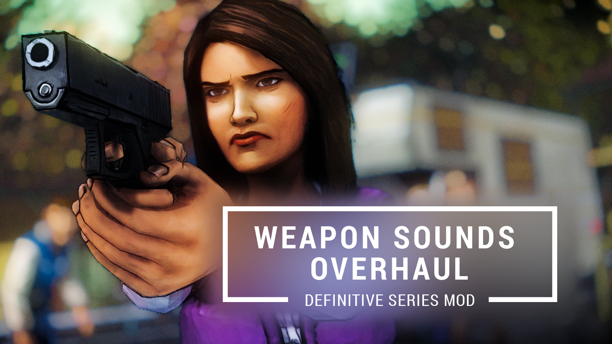

# Weapon Sounds Overhaul Mod

## DISCLAIMER

**This only works for 'The Walking Dead Telltale Definitive Edition'. If you wish to get the mod, get it [HERE](https://github.com/changemymindpls/TTDS-WPNSoundOverhaul/releases/tag/v2.0.0) and install using the [Telltale Mod Launcher](https://github.com/Telltale-Modding-Group/TelltaleModLauncher).**

## About

This mod replaces most of the weapon sounds in the TWD Definitive Series Season One and Two with more rich and punchier sounds. An example can be found here on the original Reddit post. As of the current **Version v2.0** it replaces a majority of the weapon handling/loading/firing sounds for both season one and two.

**I should note this mod only works with the Telltale Walking Dead Definitive Series.**

**If you wish to get the mod, get it [HERE](https://github.com/changemymindpls/TTDS-WPNSoundOverhaul/releases/tag/v2.0.0) and install using the [Telltale Mod Launcher](https://github.com/Telltale-Modding-Group/TelltaleModLauncher).**

